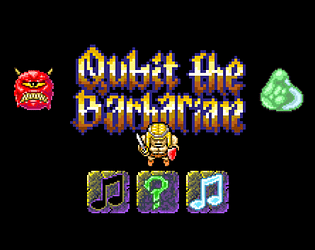
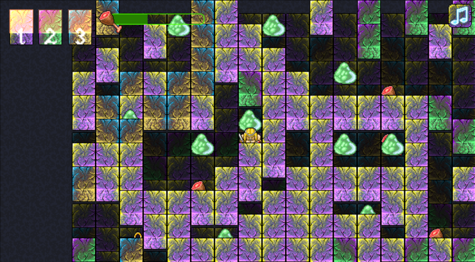
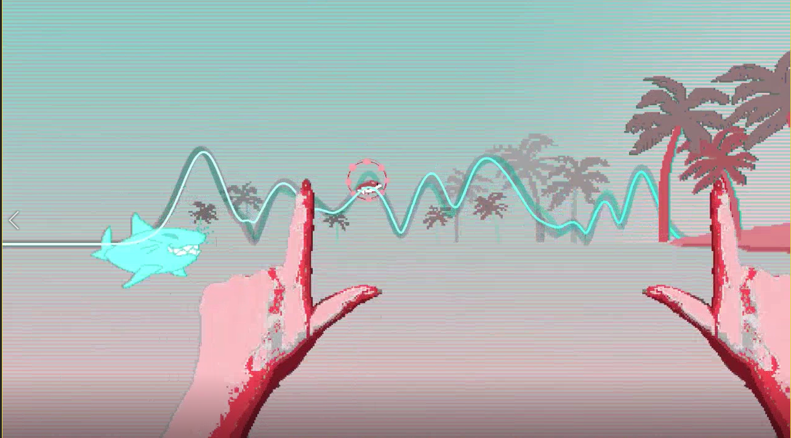
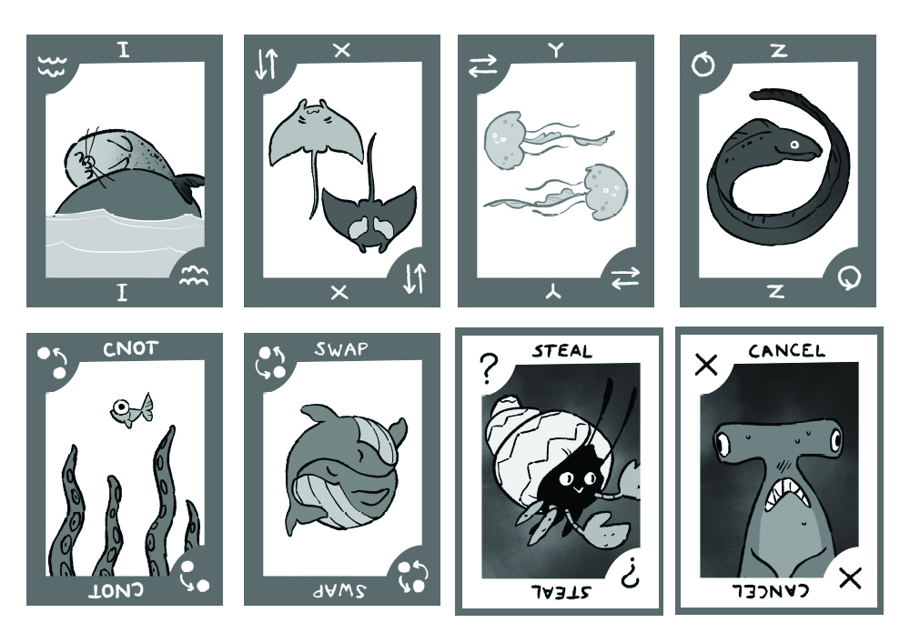
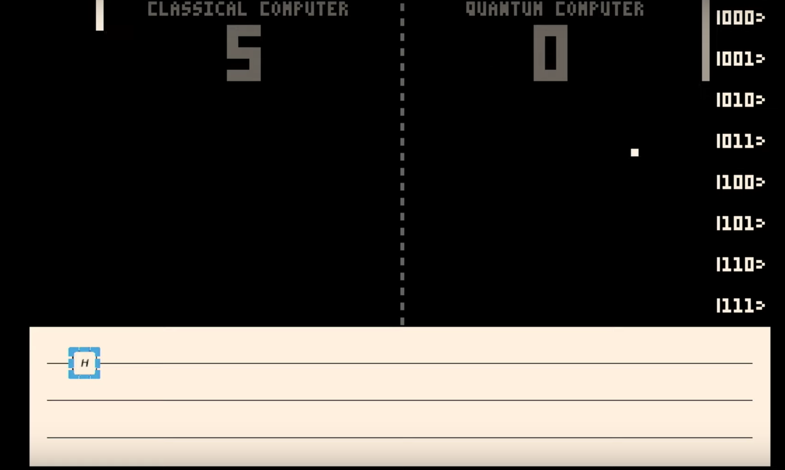
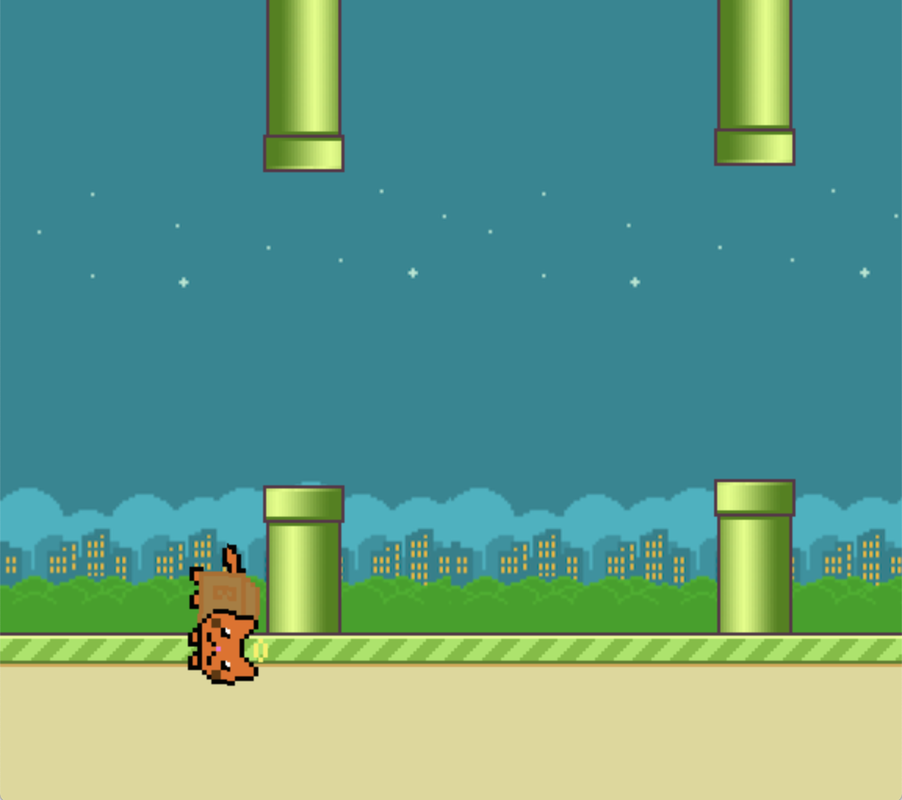
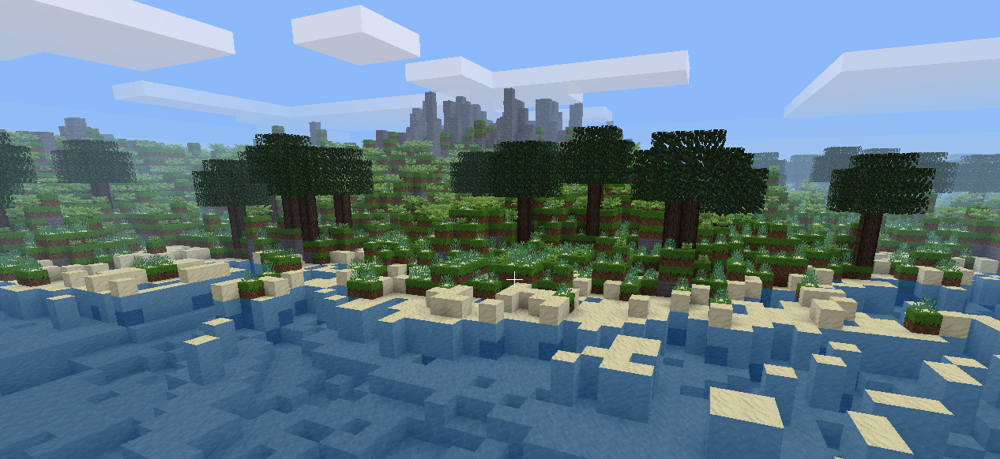
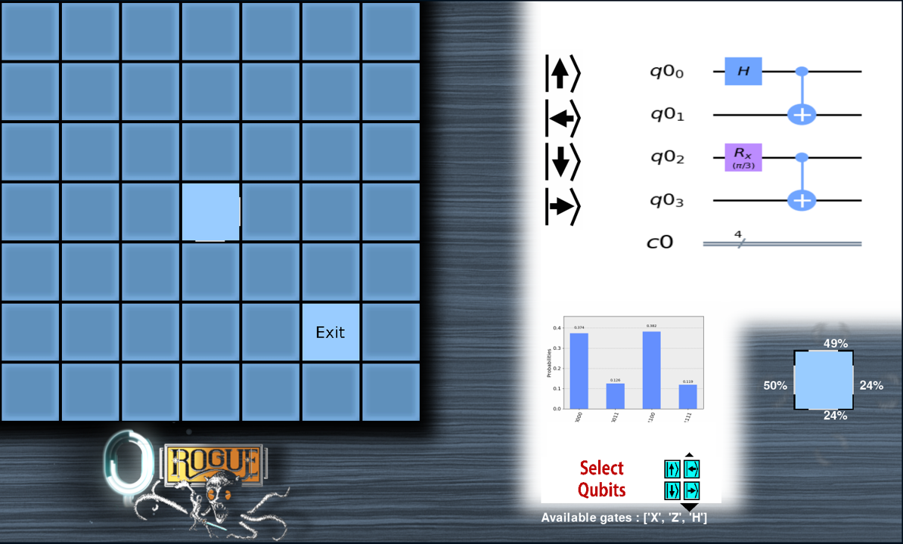
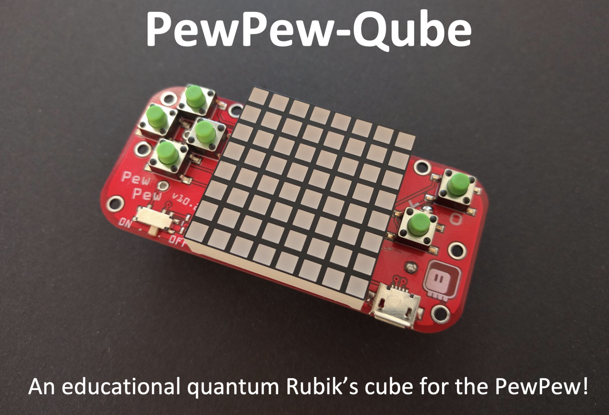
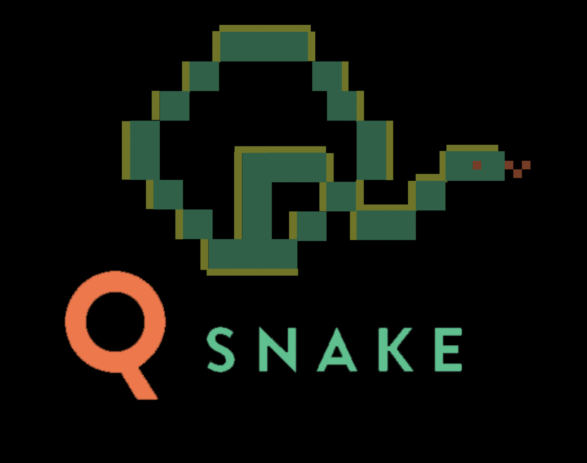

# Games for Quantum Computers in 2019 (so far)

## Quantum Wheel Game Jam

Info on all games at www.finnishgamejam.com/quantumwheel.

### Qubit the Barbarian

### Hamster Wave

### Q|Cards⟩

## Qiskit Camp - Vermont

Info on all projects at www.medium.com/qiskit in article 'Recap of Qiskit Camp 2019'.

### QPong

### Flappy Qat

## Qiskit Camp - Piz Gloria

Info on all projects at github.com/qiskit-community/qiskit-camp-europe-19

### Quantum Hold 'em

*Poker*, but quantum!

### Dr Qubit

*Dr Mario*, but quantum!

### Frozen Q

*Frozen Bubble*, but quantum!

### Quantum Rogues

Inspired by my work on procedural generation...

... They made a rogue-like.

### PewPew Cube

### Q-Snake

## Still to go

### Global/Switzerland
* IBMQ Awards, $1500 prize for a quantum game, Sept 23 - Dec 13
* Ludum Dare
* Quantum Futures Hackathon, CERN, October 18-20

### Other places
* Qiskit Hackathon @ Singapore, October 11-12
* Qiskit Camp Asia, Tokyo, November 18-21
* Qiskit Camp Africa, December 11-14
