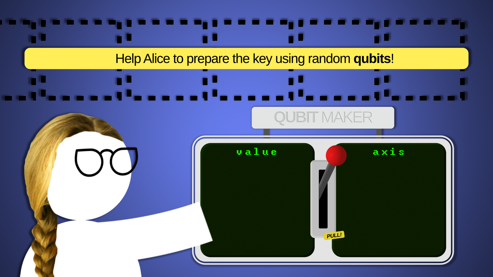

# Games for Quantum Computers in 2019 (so far)

## Quantum Wheel Game Jam

Info on all games at www.finnishgamejam.com/quantumwheel.

### Qubit the Barbarian

### Hamster Wave

### Q|Cards⟩

## Qiskit Camp - Vermont

Info on all projects at www.medium.com/qiskit in article 'Recap of Qiskit Camp 2019'.

### QPong

### Flappy Qat

## Qiskit Hackathon - Madrid

Info on all projects at www.medium.com/qiskit in article 'Recap: Madrid Hackathon'.

### BB84 game

## Qiskit Camp - Piz Gloria

Info on all projects at github.com/qiskit-community/qiskit-camp-europe-19

### Quantum Hold 'em

*No picture :(*

### Dr Qubit

*No picture :(*

### Quantum Rogues

Inspired by my work on procedural generation...

... They made a rogue-like.

*No picture :(*

### PewPew Cube

### Q-Snake

